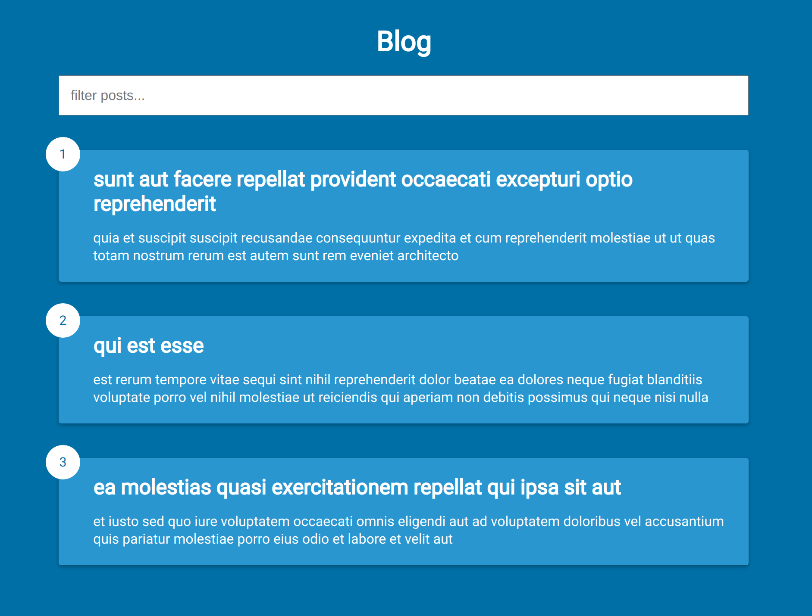

# infinite-scroll-posts

A simple blog project that fetches posts from a [third-party api](http://jsonplaceholder.typicode.com/), built using vanilla JavaScript

### Functions:

[The app](https://tn-space.github.io/infinite-scroll-posts/)

The app:

- fetches post from the API and show each time user scroll down to the bottom of the page.
- can filter out (from the current posts) posts that contain specific term either within its their title or body.

### Images:

